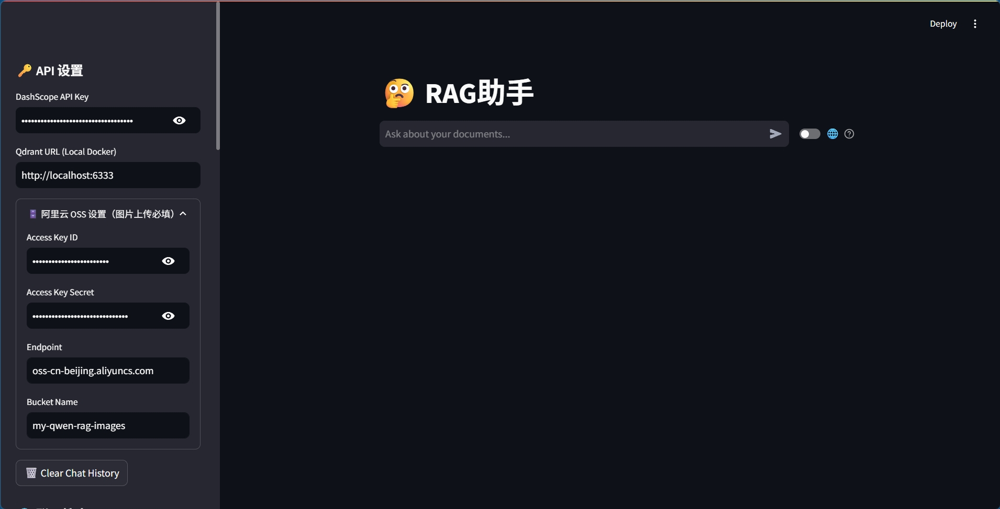
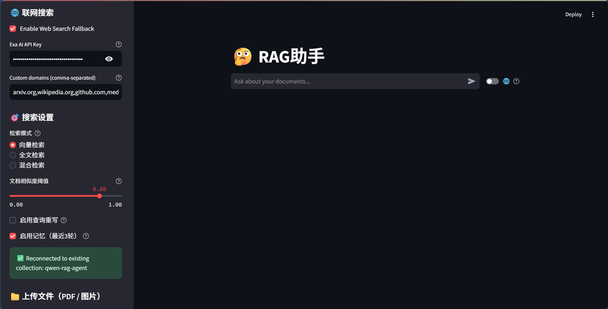
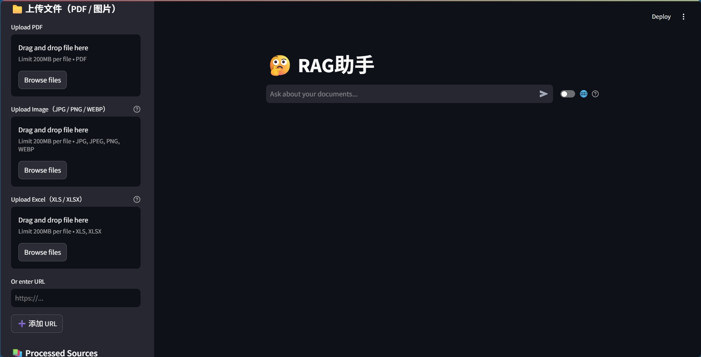
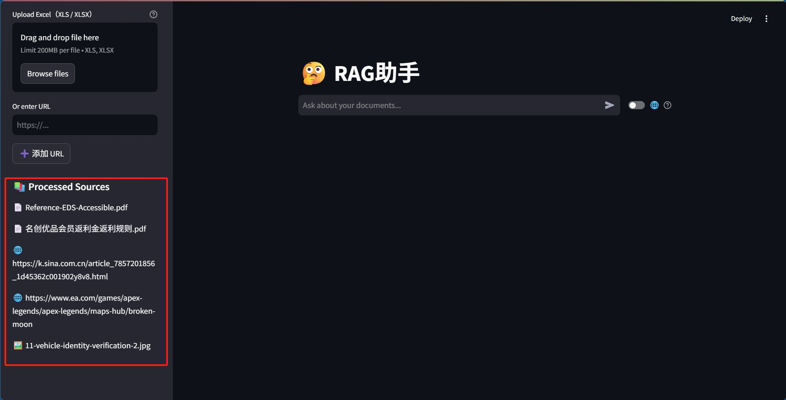

## 基于 LangChain 的多模态个人知识库助手

The code is coming soon.

### 介绍

基于LangChain+Qwen3的多模态RAG系统，深度整合混合检索与联网搜索，实现异构数据的高效语义问答与可信溯源。

 **多模态数据深度解析：**支持PDF、Excel、URL、图像等文档格式，利用LLM对表格生成分析文本，采用Qwen3-VL对图片生成结 构化描述用做向量检索，回答阶段把阿里云OSS存储图片给VLM实现看图问答，突破了传统 RAG 仅能处理纯文本的局限。

 **高性能混合检索策略：**集成Qdrant向量数据库，支持语义检索（Dense向量）、关键词检索（Sparse向量）与混合检索（RRF融 合），并引入qwen3-rerank模型重排序，采用LLM-as-a-Judge范式在部分DocBench基准数据集上评测，回答准确率达 75%。

 **Agentic智能工作流：**适当保留历史记忆，作为上下文并驱动查询重写提升多轮对话下的检索命中率；集成Exa AI工具实现联网搜 索Fallback机制，当本地向量库未命中相关知识时自动搜索最新资讯，并附带明确的来源引用，解决了私有库信息的时效性问题。 

**工程落地与交互优化：**基于Streamlit实现全栈交互，通过在Prompt中进行强约束，实现内联引用溯源机制，显著增强回答的可解 释性；在向量库中维护一个集合存储文件名，实现跨Session的已处理文档状态的追踪；提供便捷的交互体验，可在网页边栏进行 API与功能配置、文档上传、已入库文件查看；RAG中间状态实时显示，回答底部提供可折叠来源卡片，可以直观看到引用内容。

### 界面展示

界面展示：API配置

界面展示：功能配置

界面展示：文件上传

界面展示：已处理文档显示

